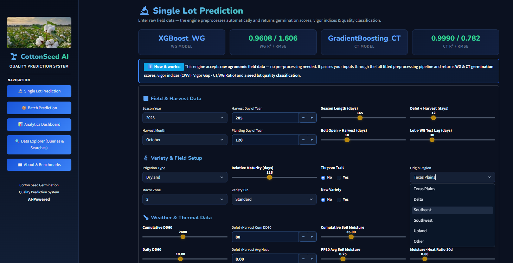

# 🌱 CottonSeed AI — Cotton Seed Quality Prediction Intelligence Model

> A next-generation AI-powered platform for predicting, interpreting, and optimizing cotton seed quality across the global agricultural value chain.

---

## 📸 Application Preview

### 🔹 Screenshot

### 🎥 Demo Video

🔗 **Live App:** https://cotton-seed-quality-prediction.streamlit.app/

---

## 📌 Project Overview

### 🧩 Business Challenge
Cotton seed quality assessment has historically been:
- Manual  
- Reactive (post-harvest testing)  
- Fragmented across systems  

This leads to:
- Poor seed lot classification  
- Yield losses and replanting costs  
- Supply chain inefficiencies  
- Mispriced inventory and financial losses  

---

### 💡 Rationale for the Project
The cotton industry spans **agriculture, textiles, and food systems**, powering a **$600B+ global value chain**.  

Cotton seed is a critical asset:
- 🌾 Cottonseed oil (food industry)  
- 🐄 Livestock feed (meal & hulls)  
- 🧵 Textile and industrial by-products  

Yet, **seed quality determines the success of the entire value chain**.

---

### 🎯 Project Objectives
This project aims to:

- Predict **seed germination performance** before planting  
- Classify seed lots into **vigor categories**  
- Provide **data-driven insights for decision-making**  
- Enable **scalable, automated seed quality evaluation**  

---

## 🧠 Key Concepts in Cotton Seed Quality

### 🌡️ Warm Germination (WG)
- Measures germination under **ideal conditions**
- Indicates **maximum viability potential**

### ❄️ Cold Test (CT)
- Measures germination under **cold stress conditions**
- Indicates **seed vigor and field performance**

---

### 📊 Derived Vigor Indices
- **CWVI (Cool-Warm Vigor Index)** = WG + CT  
- **Vigor Gap** = WG − CT  
- **CT/WG Ratio** = Cold tolerance efficiency  

These metrics determine:
- 🌟 Excellent  
- 👍 Good  
- ⚠️ Poor seed lots  

---

## 📈 Model Performance & Evaluation

| Model | Algorithm | Test R² | RMSE |
|------|----------|--------|------|
| Warm Germination (WG) | XGBoost (Optuna tuned) | **0.9608** | 1.60 |
| Cold Test (CT) | Gradient Boosting | **0.9990** | 0.78 |

### 📌 Interpretation
- WG model explains **96% of variability**
- CT model explains **99.9% of variability**
- Both models show **high predictive reliability on unseen data**

---

## 🧪 Model Validation & Generalization

To ensure real-world performance:

- Train / Validation / Test split applied  
- Cross-validation used during tuning  
- Evaluation performed on **completely unseen data**

### ✅ Generalization Proof
- Validation R² ≈ Test R²  
- Gap < **0.005**

➡️ Confirms **minimal overfitting** and strong real-world reliability

---

## 🔬 Feature Engineering & Data Integrity

### 🚫 Data Leakage Prevention
- Removed features containing **future/post-outcome information**
- Eliminated **target-derived variables**

---

### 📉 Feature Selection & Optimization

- **Pearson Correlation**
  - Removed highly correlated features (r > 0.90)

- **Variance Inflation Factor (VIF)**
  - Iteratively reduced multicollinearity (VIF < 10)

- **Mutual Information (MI)**
  - Captured **non-linear relationships** and feature importance

---

### 📊 Final Feature Set
- Reduced from **90+ → <45 features**
- Optimized for:
  - Interpretability  
  - Stability  
  - Performance  

---

## ⚙️ Tech Stack

- **Programming:** Python  
- **Data Processing:** Pandas, NumPy  
- **Visualization:** Matplotlib, Seaborn, Plotly  
- **Machine Learning:** Scikit-learn, XGBoost, LightGBM  
- **Explainability:** SHAP, LIME  
- **Model Tuning:** Optuna  
- **Deployment:** Streamlit  
- **Serialization:** Joblib  

---

## 🗂️ Project Structure
